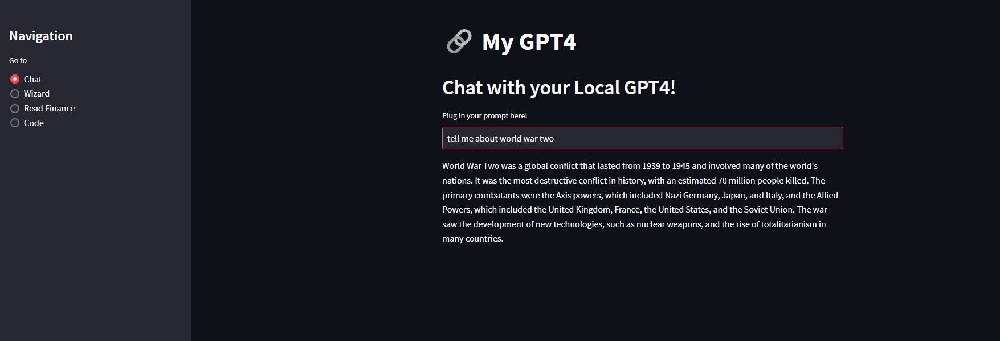
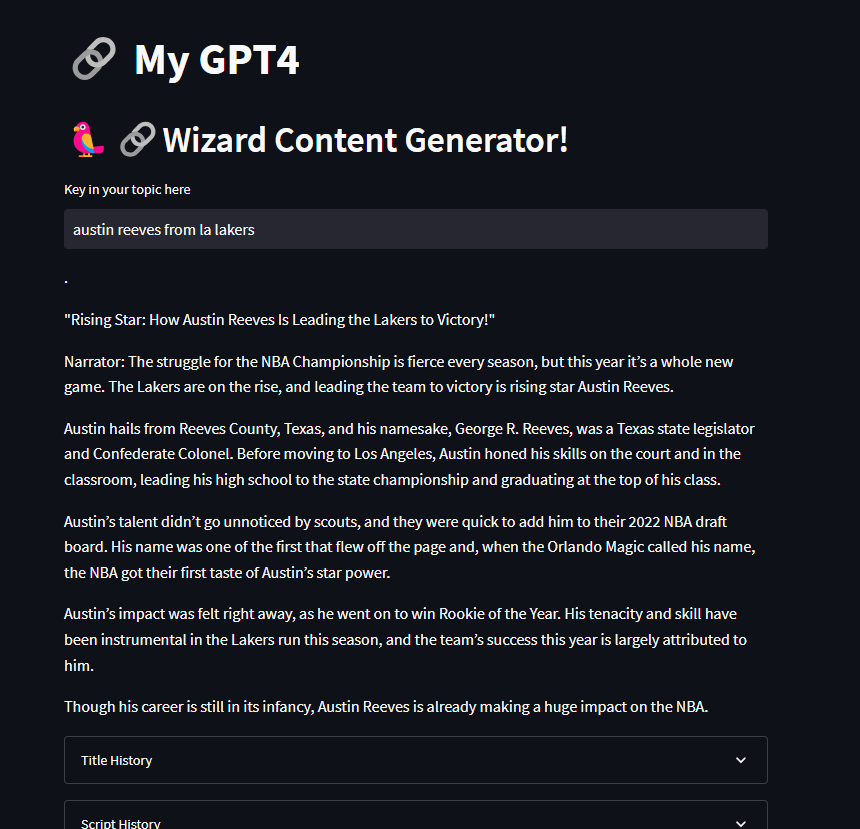
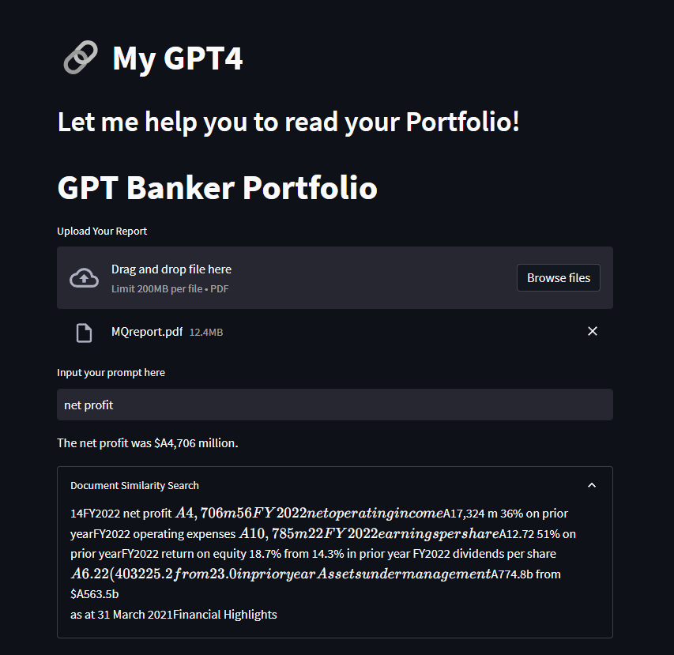
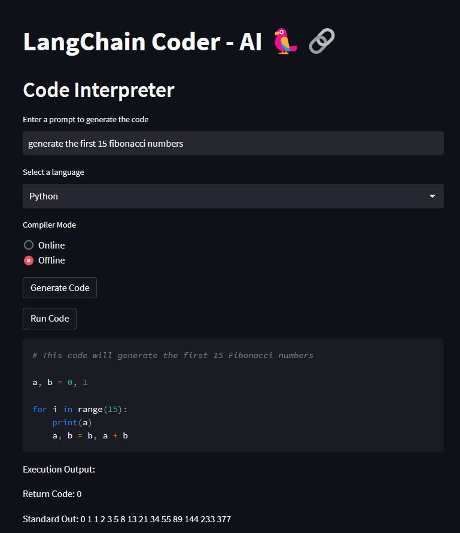

# 🤖 GPT-4 Code Interpreter, Financial Assistant and Content Creator Chat Bot

This application showcases the use of GPT-4, the large language model developed by OpenAI, to generate content based on user prompts. 

## 🎯 Features

- **Chat**(Will WORK without OpenAI and Internet Connection): Chat with the local GPT-4 if you do not have an openAI api. Input a prompt and receive a response generated by the model.  

- **Wizard**(Will generate without OpenAI, but needs Internet): A content generator that uses the model to generate creative titles and scripts.  

- **Read Finance**(need OpenAI, not stable to use local LLMs): A feature that uses the model to analyze financial reports. You can upload a PDF of a report, and the model will analyze it and generate a summary.  

- **Code**(need OpenAI, not stable to use local LLMs): Generate and fix code snippets. Input a description of a function or a faulty code snippet, and the model will generate a correct version. (Now support: **Python**, **Java**, **C**, **C++**, **Ruby**, **Scala**, **C#**, **Swift**, **JavaScript**, **GO**, **Kotlin**, **Objective C** )  

## 🚀 Getting Started

1. Create a virtual environment `python -m venv langchainenv`
2. Activate it: 
   - Windows:`.\langchainenv\Scripts\activate`
   - Mac/Linux: `source langchainenv/bin/activate`
3. Clone this repo
4. Download the required LLM models from GPT4All UI and take note of the PATH they're installed to. You will need to change the PATH to your dir that contains the downloaded pre-trained models  
5. Install the required dependencies `pip install -r requirements.txt`
6. Add your OpenAI APIKey to line 2 of `apikey.py`, if you do not have openai api, you can only use chat and wizard. Btw & FYI, You can also use chat without Internet
7. Start the app `streamlit run app.py`  

## 👩‍💻 Author
**Sheng Yun**
- Github: [@nickShengY<nickShengY>](https://github.com/nickShengY)
- Email: <syun13@fordham.edu>/<s24yun@uwaterloo.ca>

